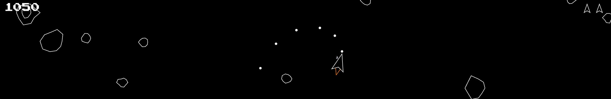
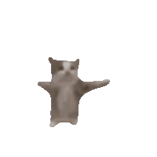

<h1 align="center">
  :rocket: kiro-asteroids
  <p align="center">
    <a href="http://vanilla-js.com/"></a>
    <a href="#"></a>
    <a href="https://kiro.dev"></a>
  </p>
  <a href="https://juangutie.github.io/kiro-asteroids/"></a>
</h1>

Shoot down asteroids on web or mobile at [juangutie.github.io/kiro-asteroids/](https://juangutie.github.io/kiro-asteroids/)

## Controls
- Using a keyboard :keyboard: :
  - <kbd>W</kbd><kbd>A</kbd><kbd>S</kbd><kbd>D</kbd> (or arrow keys <kbd>↑</kbd><kbd>←</kbd><kbd>↓</kbd><kbd>→</kbd>) to move around
  - <kbd>Space</kbd> to shoot
- Using a mouse :computer_mouse: :
  - <kbd>Left click</kbd> where you want to go
  - <kbd>Right click</kbd> to shoot
- Using a phone :iphone: :
  - <kbd>Lean</kbd> your phone in the direction you want to go
  - <kbd>Tap</kbd> to shoot

## Installation

1. Clone this repository:

    ```bash
    git clone https://github.com/juangutie/kiro-asteroids/
    ```

2. Navigate to the cloned repository:

    ```bash
    cd kiro-asteroids/
    ```

3. Start a local server in the current folder, for example, with Python:

    ```bash
    python3 -m http.server 8000
    ```

    This will start a local server on port 8000

4. Go to [`http://localhost:8000`](http://localhost:8000) on your web browser and you should see the game running locally.

## Development Thoughts

I started this project to try out the student tier of [Kiro CLI](https://kiro.dev/docs/cli/), an AI coding agent. I tried to be as hands-off as possible while still leveraging my understanding of javascript and game systems. In total, it took a pair of evenings and about $4 worth of credits to make this. Here are my takeaways:

### Prototyping is fast.



I told Kiro to start with a ship that moves and turns around in space. I told it to add bullets. Then to add asteroids, add lives, a pixel font score counter, respawn invincibility, game over and completion screens — I felt like a kid again. In between, I had to look disapprovingly at some of the code it was spitting out and periodically get it to refactor, but it felt liberating to once again create something with little regard for structural integrity.

### The code sucks.


Yeah, yeah, it works and whatever and there's no obvious bugs. But adding more features to this would become a nightmare. The AI doesn't out-of-the-box differentiate between a job done and job well done. It replicates outdated snippets of stackoverflow code, and if you ask it to add a feature, it doesn't mind leaving a heaping pile of mess in its wake. Each time I tried getting it to refactor, pointing out specific issues, Kiro went on credit spending sprees for wee improvements.

### There is a learning curve.


I have some opinions about how code should be written. There is also a whole lot that I don't know about. Whether it's through agent skills, steering, spec-driven development or whatnot, if I can impart some of my opinions unto the AI agent, I can spend less time wrestling with it and more time creating.